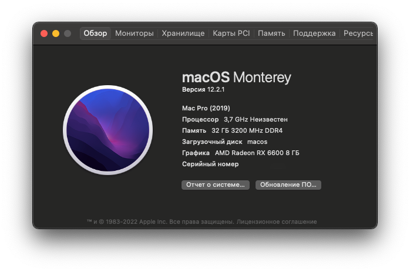
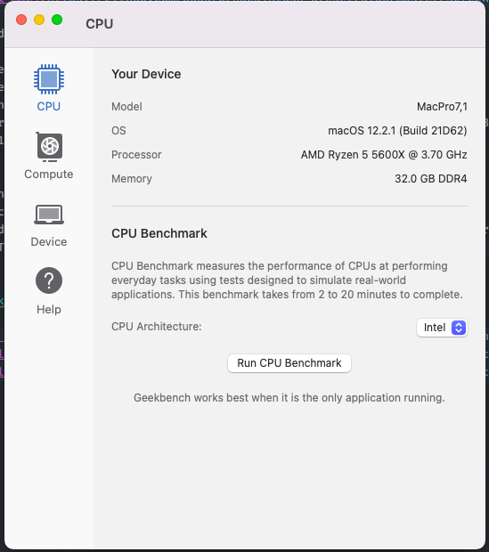
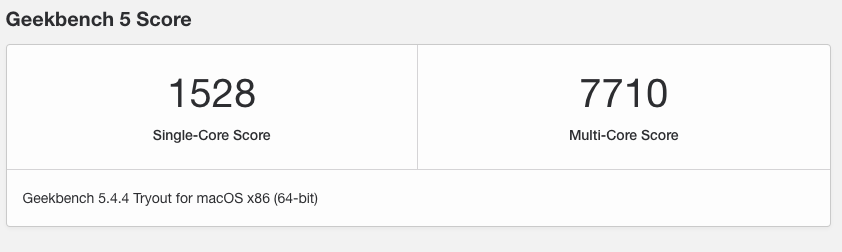
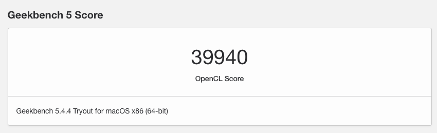

# Ryzentosh (Hackintosh with Ryzen) OpenCore 0.7.8
## MacOS Monterey 12.2.1

Create USB by [this guide](https://dortania.github.io/OpenCore-Install-Guide/installer-guide/) (I made on Windows)

My hardware:

- Processor: AMD Ryzen 5 5600x
- Mother Board: GIGABYTE B550 AORUS ELITE V2
- Graphics Card: Sapphire AMD Radeon RX 6600 8 ГБ
- Memory: 32GB (4x8GB) G.SKILL Ripjaws V DDR4 3600 МГц DIMM CL18 F4-3600C18D-16GVK
- SSD 1000 ГБ SSD M.2 Goodram PX500 SSDPR-PX500-01T-80

Base info:
* 3D Acceleration work
* Sound and Microphone work (I use USB Headphones (HyperX Cloud Stinger Core Wireless 7.1 HHSS1C-BA) & USB microphone (Marantz Pod Pack 1))
* FaceTime and another work

## Geekbench

